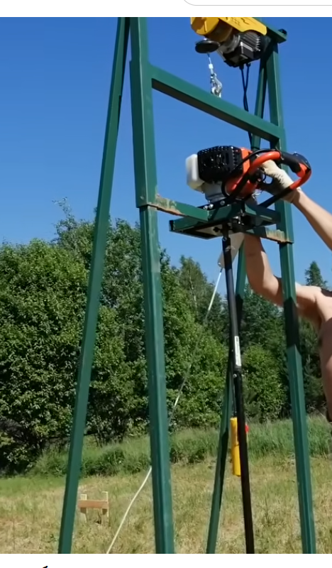
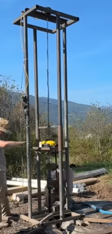

# Бюджетный сетап для бурения

Жизнь в удаленной локации предполагает определенную долю 
самостоятельности и необходимость обеспечивать свои базовые потребности.
Таким образом, очень полезными скиллами являются такие, как строительство зданий и создание колодцев.
Колодцы предполагают бурение скважин в земле для получения воды. Ддля возведения же зданий требуется фундамент, и одним из недорогих способов
его установить являются сваи ТИСЭ, которые заливаются бетонным раствором прямо в проделанные в земле лунки.
Таким образом, владение оборудованием для бурения отверстий в земле открывает широкие возможности по 
расширению своего хозяйства.

Однако же профессиональное оборудование дорого и его тяжело достать, вследствие чего встает вопрос о создании подобного
сетапа из недорогих и широко распространенных компонентов.  

## Стойка для бурения

Рассмотрим существующий паттерн для недорогого бурения скважин, на примере следующих видео:
1) Видео о бурении лунок под сваи ТИСЭ: https://youtu.be/7F8-lUCe0SA?si=mZv_GTVLLLl7FKWx&t=614   
   

2) Видео о бурении колодцев: https://www.youtube.com/watch?v=79wHBi92w6c   
   

В этих видео (и не только) можно найти широкое разнообразие самодельных стоек для бурения.
Паттерн же при этом всегда один и тот же - высокая устойчивая стойка, лебедка, прикрепленная на самом верху
и мотобур на подвижном элементе, двигающийся вертикально под воздействием силы тяжести (вниз) или лебедки (вверх).

Решения, которые я находил в подобных видео, как правило не очень универсальны, и заточены не просто под конкретную задачу,
а под конкретную задачу, учитывая те ее условия, которые существуют у конкретных решающих ее людей - авторов.
Также я не видел попыток задизайнить нечто, что было бы легко разбираемым, ремонтопригодным, модифицируемым / расширяемым,
и было бы собрано из стандартных компонентов.

Решая задачу о бурении колодцев или абиссинских скважин, использует метод гидробурения, при котором задействованы
стальные трубы с резьбой и фиттинги. Задумавшись об этих компонентах, я пришел к выводу, что их можно использовать также
для создания самой стойки, при этом в силу их стандартности, конечная конструкция будет обладать всеми вышеупомянутыми
свойствами.

Рассмотрим первоначальный вариант дизайна стойки их этих компонентов в следующем файле: 
[CTouKa gJIR 6ypeHuR.pdf](CTouKa%20gJIR%206ypeHuR.pdf)

Как видим, сборка стойки происходит из труб стандартного размера и стандартных же фиттингов, т.е. вся конструкция легко 
может быть собрана и разобрана.  
В файле также показаны примеры того, как базовую конструкцию можно расширить - усилив крепление лебедки или же добавив 
распорки внизу для лучшей устойчивости.  
Кроме этого, можно изменять высоту или размеры основания стойки, путем подбора длины отдельных используемых труб, а также
изменять массу и максимальную нагрузку всей конструкции, путем изначального выбора диаметра труб. Меньший диаметр облегчает массу,
но также снижает максимально возможную нагрузку, увеличение диаметра - наоборот, позволяет большую нагрузку, но и 
масса при этом растет.

Как мы видели во видео 2 (от канадцев), созданная ими кострукция не только ригидна, т.к. сварена намертво, 
но также гораздо больше по размеру и тяжелее, чем ей стоило бы быть (ИМХО). Ее с большим трудом приходится носить двум
взрослым людям, и для транспортировки необходим грузовик типа truck. По этим качествам их стойка напоминает мне скорее 
дизайн некой гильотины для казни бегемотов.  
В то же самое время мой дизайн легко разбирается и перевозится в багажнике обычной легковушки (во всяком случае, если 
в ней задние сиденья складываются, как у всех японцев).

Более того, в моем дизайне можно без потери транспортабельности и для увеличения крепости конструкции также сварить 
вместе отдельные группы элементов - например, нижнюю и верхнюю опорные плоскости, или же подвижный элемент, т.к. 
их каждый раз разбирать "по винтику" непринципиально, и они транспортабельны и такв собранном виде.

Для улучшения же мобильности на месте работ можно приделать к стойке 2 колеса, на которых проще будет перемещать ее 
от лунки к лунке, как сделано, например, в видео 1.

Единственный недостаток моего дизайна - более высокая цена, т.к. фиттинги и трубы с резьбой оказались дороже простых железяк.
Конечно, гораздо дешевле будет просто сварить всю конструкцию, не используя при этом более дорогих компонентов.  

Однако я счел данную "переплату" для себя приемлемой, т.к. мой дизайн дает несравненную гибкость при транспортировке, использовании, и 
неограниченные возможности по улучшению, добавлению новых фич, апгрейду и даже ремонту, по следующим пунктам:
- Стойку легко самому собрать из готовых купленных компонентов, как конструктор, и в базовом варианте ничего не нужно 
приваривать, все крепится очень просто, путем вкручивания труб в фиттинги;  
- Учитывая мою цель использовать эту же самую стойку как для бурения колодцев, так и для закладывания свай фундамента 
по технологии ТИСЭ, возможность модификации, тюнинга и апгрейда конструкции в ходе практических испытаний также очень 
важна для меня;
- И, наконец, возможность транспортировки бурового сетапа в дальние локации без найма спец-ранспорта (которым я не владею), 
а просто разобрав и закинув в багажник легкового авто - это также очень важная для меня фича.