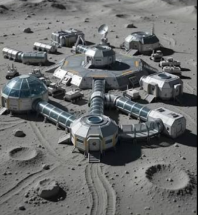

# Модульный подход к бюджетному строительству

Некоторые принципы модульного дизайна, похожие на те, которые используются в софтверных проектах, воплощенные в домостроительстве. (Может даже и микросервисную архитектуру кому-то напомнит)

## Модули и преимущества модульной архитектуры

Начну со ссылки на видео, в котором показано то, что автор видео считает модулем, и мы с ним согласны.  
Лучше один раз увидеть.  
https://www.youtube.com/watch?v=78MlVBS7nXs

Затем представим несколько таких жилых модулей, плюс рядом модуль-баню, модуль-столовую, модуль-спортзал, модуль-мастерскую, гостевой модуль (как гостевой домик у помещиков) и т.д. - что-то вроде космической базы на другой планете. Или в Антарктиде.  
Только окна не такие большие.

WARNING: ЭТО НЕНАСТОЯЩАЯ БАЗА. ПРОСТО КАРТИНКА ДЛЯ ПРИВЛЕЧЕНИЯ ВНИМАНИЯ.  

Преимущества - каждый модуль недорог, можно построить отдельный модуль относительно быстро и дешево (особенно без чистовой отделки).  
После постройки можно сразу начать использовать новый модуль, при этом параллельно строя и достраивая другие модули, в отличие от одного большого дома (как бы, разбиваем монолит?).  

Любые возникшие проблемы будут с большой долей вероятности также локализованы внутри одного модуля, маловероятно, что одна проблема затронет сразу все модули.  
Починка отдельного модуля также проще и дешевле.  

Отопление каждого модуля также будет отдельным, что позволит оптимизировать потребление топлива или энергии.  

Для большей оптимизации расходов можно лимитировать функциональность некоторых модулей, например, для некоторых целей строить dry-модули, т.е. не подключать воду / канализацию, что позволит упростить и сэкономить. На севере многие живут в т.н. dry cabins, так что это даже не моя идея. Но жизнь в такой cabin это сильно по-хардкору (свидетельствую), оптимально иметь все-таки доступ к воде и удобствам. В данной архитектуре логичнее всего предоставить это отдельным модулем (как то, модуль-баня/laundromat).  
Т.о. на несколько dry-модулей можно построить один wet-модуль, оптимизируя затраты, и не идя при этом на компромиссы по качеству жизни.  

Идеально для быстрого и гибкого масштабирования.  
Как то, для компаний, если нужно расселить новых людей - например, это кампус, и команда растет (офис-модуль); или недвижимость арендуется, и произошел скачок спроса на ренту (жилой модуль) - можно наклепать нужного типа модулей в порядке приоритета.  

Еще, как замечено в видео (https://www.youtube.com/watch?v=V7UWD0qKm8A), такие модули можно также перемещать и даже транспортировать. Т.о. если в одном месте модулей стало с избытком и их утилизация упала, а в другом наоборот не хватает, в теории, можно их перебалансировать, переместив физически (это уже фишка из распределенных хранилищ данных, решардинг).  
В общем, только стыковки между модулями и трансформации в единый модуль-Вольтрон не хватает для полного счастья.  

Также, подобная мобильность облегчает добавление или починку подземных коммуникаций - электричество, водопровод, канализация, интернет и пр. Т.к. можно просто временно переместить модуль, разрыть землю, провести или починить коммуникации, и поставить его обратно.  

И даже можно легко починить или усилить сам фундамент - если сваи покосило, например. Можно даже вместо свай для экономии использовать простые бетонные блоки (собственно, как и делает автор видео), которые, скорее всего, неравномерно уйдут в землю со временем, но исправить это будет очень легко и просто. Или же со временем переставить модуль на сваи, просто чтобы исключить стоимость свай из единовременных расходов при создании модуля (что существенно, учитывая как дешево сделать сам модуль).  
В общем, +100500 к flexibility и maintainability.  

Из недостатков - отсутствие возможности строить вверх во много этажей, экономя землю. Но там, где планируется строить, земли пока хватает и это не такая большая проблема, хотя должен признать, что даже там стоит она несколько дороже, чем хотелось бы.  

## Мысли по созданию домохозяйства на новом месте с применением модульной архитектуры

Более детально прикинув, составил такое вот "дерево технологий" по созданию базового жилищного сетапа.  
[Initial Module map.pdf](Initial%20Module%20map.pdf)

M1 - это самая база, куда можно начать перевозить вещи, хранить материалы и инструменты для дальнейших работ.  

В M2 уже можно селиться, если есть опыт жизни в dry cabin, или же пробурив на скорую руку абиссинскую скважину.  
Проблема последней в том, что я не знаю, как она себя поведет очень холодной зимой (предполагаю, что замерзнет) и как этого избежать (наверное, нужен обогрев, но не знаю, как его рассчитать или на какую глубину устанавливать).  

Ну а M3 это уже "полноценная жизнь" с водопроводом и всеми удобствами.  
Дальше только роскошь - спортзалы, беседки, крытый паркинг и т.д.  

Как видим, имеет место быть существенный объем предварительных работ. Тут все зависит от участка - можно найти ровную землю без деревьев, по которой машина и так проедет, куда можно приезжать прямо на машине, там же парковаться, и сразу начинать строить. А есть и такие, что там огромные перепады высоты, и какие-то сплошные овраги - для бюджетного строительства такое, конечно, не подойдет.  
Идеально, чтобы было без какого-то экстремального терраформирования, ну максимум - вырубить несколько деревьев и насыпать щебня.  
Здесь у меня выходит небольшой конфликт интересов, т.к. жить на лысом месте не очень в моем вкусе, но при этом хотелось бы минимизировать расходы за подъездную дорогу, вырубку и расчистку площадки.  
Настоящие мастера bushcraft сразу на месте из этих же срубленных деревьев делают пиломатериал и из него строят, но я такое явно не вывезу по скиллам 🙂  

Близость к коммуникациям это тоже хорошо, желательно минимизировать длину личной дороги, чтобы поближе к участку проходила государственная дорога, по которой лучше всего добираться до трассы.  

Также, подключение к электросети лучше иметь, чем нет. Я имею опыт жизни на чистом solar (весной-летом), и этот заряд порой экономить приходится нереально, просто как остаток зарплаты ипотечнику в Москве.  
А если дожди и подряд несколько пасмурных дней, начинается просто жесть, т.к. батареи на минимальном заряде, и энергии просто не хватает ни на что. Так что, хотя и можно этим покрыть 75% своих необходимостей, но лучше все же с бекапом в виде нормального электричества, чем без него.  
Как было бы без подключения к электросети северной зимой, с короткими днями и тусклым солнцем, представить сложно. С 10 панелями по 250W просто нереально. Думаю, для этого нужно было бы где-то между 35-50 панелей, и батарею в 2-4 раза больше. Но можно представить, как весело было бы эти 50 панелей регулярно очищать от снега. В общем, в условиях жизни на севере подключение к электросети strongly recommended.  
